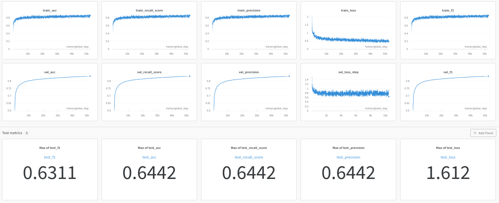
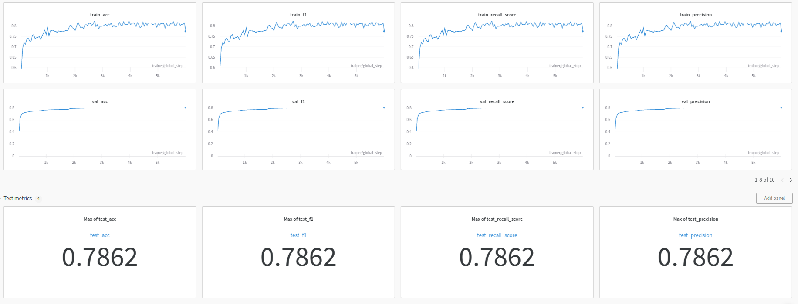
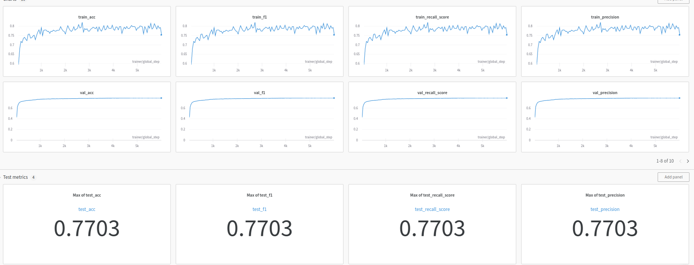

# product-graph


[ogbn-products task](https://ogb.stanford.edu/docs/nodeprop/#ogbn-products) solution.

Written using PytorchLighthing & PytorchGeometric & Weights&Biases for experiment tracking.


## Task description

**Graph**: The ogbn-products dataset is an undirected and unweighted graph, representing an Amazon product co-purchasing network. Nodes represent products sold in Amazon, and edges between two products indicate that the products are purchased together. Node features are generated by extracting bag-of-words features from the product descriptions followed by a Principal Component Analysis to reduce the dimension to 100.

**Prediction task**: The task is to predict the category of a product in a multi-class classification setup, where the 47 top-level categories are used for target labels.

**Dataset splitting**: We use the sales ranking (popularity) to split nodes into training/validation/test sets. Specifically, we sort the products according to their sales ranking and use the top 8% for training, next top 2% for validation, and the rest for testing. This is a more challenging splitting procedure that closely matches the real-world application where labels are first assigned to important nodes in the network and ML models are subsequently used to make predictions on less important ones.


## Instructures

1. Setup environment (python >=3.10):

```
pip install -r requirements.txt
pip install -U rich

```

Special instructures for pytorch geometric, see here: https://github.com/pyg-team/pytorch_geometric:
```
pip install pyg-lib torch-scatter torch-sparse -f https://data.pyg.org/whl/torch-1.13.0+cu116.html
pip install torch-geometric

```

2. Download dataset:

```
python src/data/download.py
```

3. Start training (all hyperparameters must be specified in configuration file (e.g. `src/configs/config.py`)):

```
python src/train.py --config <path_to_config>
```


## **Solutions**

### 0. **EDA**

See [here](notebooks/eda.ipynb). Key highligths: 

- Number of *vertices*: 2449029 with embeddings dimensionality: 100
- Number of *edges*: 123718280
- Number of *classes*: 47
- Dataset is imbalanced.


### 1. **Baseline**

Multi-layer perceptron trained only on vertices embeddings (169k parameters).

This solution does not take into account any information about relations between vertices so there is no graph-specific approaches are used. We can even consider this baseline as NLP task because vertices embeddings were extracted with BOW-method.

**Scores:**



Without using any information of the graph structure we can achieve 64.4% accuracy of predictions.

Config: `src/configs/config_mlp.py`


### 2. **Graph Convolutional Network**

Graph Convolutional Network (338k parameters). 

The convolution layer used here is SAGEConv with mean aggregation. This type of convolution can be visualized as follows ([source](https://arxiv.org/pdf/1706.02216.pdf)):


GraphSage is an *inductive* version of GCNs. It does not require the whole graph during training and it can generalize well to the unseen nodes. So this is the most suitable choice for dynamic graphs.

As other graph neural network architectuers it assumes that neighbor vertices have similar embeddings and properties. 

Feature extraction for each vertex is perfomed in 2 stages: 

1. **SA**mpling: sample neihgbour vertices for the current one on different depths;

2. Aggre**G**at**E**: aggregate embeddings of chosen vertices. Agreggation functions can be different, the basic are mean, max/min.

We use mini-batch training because the whole graph is quite large, so full-batch training requires enormous ammount of computing capacity. We use **ClusterSampling** during **training** because it divide initial full graph into multiple subgraphs with algorithm described in *"Cluster-GCN: An Efficient Algorithm for Training Deep and Large Graph Convolutional Networks"*. During testing (or inference) we use only **NeighbourSampling** because we do not need to know the whole graph (or subgraph) for the current node, only its neighbours.

**Scores:**




We significantly increase (+14.2%) the accuracy of prediction on test set comparing to baseline using graph neural networks. Consequently, the relationship between objects can store very useful information for further research of their properties. 


Config: `src/configs/config_gcn.py`


### 3. **Graph Convolutional Network + loss for imbalanced data**

EDA showed that dataset is highly imbalanced: the largest class contains almost 700k objects while the smallest one contains less than 10k objects. We can try to handle this problem using special type of losses, e.g. FocalLoss. The model architecture is the same as in p.2 but now we use FocalLoss for training.

**Scores:**



But we can see that using FocalLoss instead of CrossEntropyLoss only resulted in a lower metric.

Config: `src/configs/config_gcn.py`. To run this experiment: 
```
python src/train.py --config src/configs/config_gcn.py --loss focal
```
